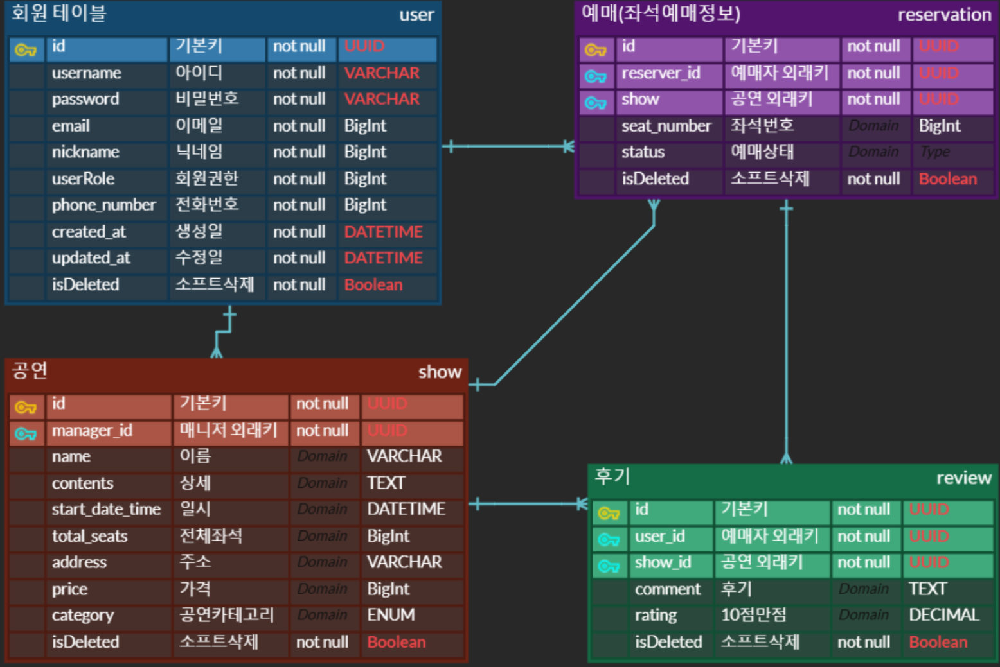
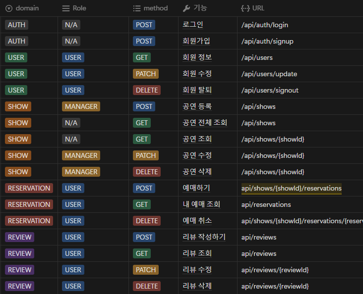

<!-- _class: title -->
# 동시성 제어 기반 <br>티켓팅 서비스 구현
### 12조 **i2**

<br>

김혜진 · 이한식 · 장재혁 · 이지훈


---
# 📁 발표 패키지 구조 >

<div class="grid-container">

<div class="grid-item">

## 🎨 설계 단계

- 🚀 **프로젝트 개요**
- 🎯 **기술적 목표**

</div>

<div class="grid-item">

## 💻 구현 단계

- ⚙️ **핵심 기능 소개**
- 🎥 **영상 시연**
- 🔧 **트러블슈팅 소개**

</div>

</div>

<style scoped>
.grid-container {
  display: grid;
  grid-template-columns: 1fr 1fr;
  gap: 2rem;
  margin-top: 2rem;
}
.grid-item {
  padding: 1rem;
  background: rgba(255,255,255,0.1);
  border-radius: 8px;
}
</style>

---
<!-- _class: title -->
## 🎨 설계 단계

- 🚀 **프로젝트 개요**
- 🎯 **기술적 목표**

---

# <span class="stage">설계/</span> <span class="symbol">✨</span> 프로젝트 개요

## <span class="title">주제 선택</span>

<div class="topic-container">
  <div class="topic-main">
    <h3>동시성 제어</h3>
    <div class="level">
      <span class="badge">난이도: 상</span>
    </div>
  </div>

  <div class="service-info">
    -> <h4 style="display: inline;">🎯 온라인 티켓팅 서비스</h4>
  </div>

  > - **동시다발적 요청**에 에한 동시성 제어 주제에 적합
  > - CRUD 를 단순화하여 **도전 목표**에 집중

</div>

<style scoped>
.title {
  border-bottom: 3px solid #4a90e2;
  padding-bottom: 5px;
}

.topic-container {
  margin: 20px;
  font-size: 1.2em;
}

.topic-main {
  display: flex;
  align-items: center;
  gap: 15px;
  margin-bottom: 20px;
}

.badge {
  background-color: #ff7043;
  color: white;
  padding: 5px 10px;
  border-radius: 15px;
  font-size: 0.8em;
}

.service-info, .goal {
  margin-left: 30px;
  margin-bottom: 15px;
}

.service-name {
  color: #4a90e2;
  font-weight: bold;
  margin-left: 20px;
}

.goal-detail {
  margin-left: 20px;
  color: #666;
}

h3, h4 {
  margin: 0;
  color: #333;
}
</style>

---
# <span class="stage">설계/</span> <span class="symbol">✨</span> 프로젝트 개요

## <span class="title">**인터파크**를 참고한 와이어프레임 작성</span>


<div class="content-wrapper">
  <div class="description">
    <h3>📋 Interparty 핵심 API</h3>
    <ul class="feature-list">
      <li><span class="highlight">일반 사용자</span>
        <ul>
          <li>공연 전체 조회</li>
          <li>공연의 특정 좌석 예매</li>
        </ul>
      </li>
      <li><span class="highlight">공연 담당자</span>
        <ul>
          <li>공연 정보 등록</li>
        </ul>
      </li>
    </ul>
  </div>
</div>

<style scoped>

.description {
  padding: 20px;
  background: rgba(255, 255, 255, 0.9);
  border-radius: 8px;
  box-shadow: 0 2px 4px rgba(0,0,0,0.1);
}

.feature-list {
  list-style-type: none;
  padding-left: 0;
}

.feature-list li {
  margin-bottom: 15px;
}

.feature-list ul {
  list-style-type: circle;
  margin: 8px 0;
  padding-left: 20px;
}

.highlight {
  color: #4a90e2;
  font-weight: bold;
}

h3 {
  color: #333;
  margin-top: 0;
  border-bottom: 2px solid #4a90e2;
  padding-bottom: 8px;
}
</style>

---
# <span class="stage">설계/</span> 🎯 기술적 목표

<div class="goals-container">
  <div class="main-goal">
    <h3>🎯 주요 목표: Redis 응용 기능 둘 다 구현</h3>
    <div class="goal-cards">
      <div class="goal-card">
        <h4>🔒 동시성 제어</h4>
        <p>분산 락을 통한 안전한 티켓팅 구현</p>
      </div>
      <div class="goal-card">
        <h4>💨 캐싱</h4>
        <p>빠른 응답을 위한 데이터 캐싱 구현</p>
      </div>
    </div>
  </div>

  <div class="sub-goals">
    <h3>✨ 부가 목표: 플러스 주차 학습 성과 반영</h3>
    <div class="tech-list">
      <div>
        <span class="tech-icon">🛠</span>
        <strong>Kotlin 100%:</strong>
        프로젝트 생성부터 테스트까지 순수 코틀린으로 구현
      </div>
      <div>
        <span class="tech-icon">🐳</span>
        <strong>Docker:</strong>
        MySQL, Redis 등 컨테이너 기반 개발 환경 구성
      </div>
    </div>
  </div>
</div>

<style scoped>
.goals-container {
  display: flex;
  flex-direction: column;
  gap: 1rem;
  margin-top: 0.5rem;
  font-size: 0.9em;
}

.goal-cards, .tech-stack {
  display: flex;
  gap: 1rem;
  margin-top: 0.5rem;
}

.goal-card, .tech-item {
  background: rgba(49, 130, 206, 0.1);
  padding: 0.8rem;
  border-radius: 8px;
  flex: 1;
}

.goal-card h3 {
  color: #333;
  margin-top: 0;
  border-bottom: 2px solid #4a90e2;
  padding-bottom: 8px;
}
</style>

---
<!-- _class: title -->
## 💻 구현 단계

- ⚙️ **핵심 기능 소개**
- 🎥 **영상 시연**
- 🔧 **트러블슈팅 소개**

---

# <span class="stage">구현/</span> ⚙️ 핵심 기능 소개

## ERD, API 테이블

<div class="erd-container">
  <div class="erd-item">
    
  </div>
  
  <div class="erd-item">
    
  </div>
</div>

<div class="placeholder-image">
  
</div>

<style scoped>
.erd-container {
  display: flex;
  justify-content: center;
  gap: 2rem;
}

.erd-item {
  background: rgba(255, 255, 255, 0.5);
  display: flex;
  align-items: center;
}

.placeholder-image {
  position: fixed;
  bottom: 50px;
  right: 100px;
  z-index: 100;
}

.placeholder-image img {
  width: 300px;
  height: 100px;
  border-radius: 8px;
  box-shadow: 0 2px 4px rgba(0,0,0,0.1);
}
</style>

---
# <span class="stage">구현/</span> 🎥 영상 시연

## 시연 내용
- 내용 작성

## 주요 포인트
- 내용 작성

---
# <span class="stage">구현/</span>🔧 트러블슈팅 소개

---

# 텍스트 스타일 활용


- **굵은 글씨** 강조
- *기울임체* 활용
- ~~취소선~~ 표현
- `코드` 표시

> 💡 **디자인 팁**
> 텍스트 강조는 적절히 사용할 때 가장 효과적입니다.

---

# 데이터 시각화

| 항목 | 기본 | 프로 | 엔터프라이즈 |
|:--|:--:|:--:|--:|
| 기능 1 | ✓ | ✓ | ✓ |
| 기능 2 | - | ✓ | ✓ |
| 기능 3 | - | - | ✓ |
| 가격 | 무료 | ₩10,000 | ₩30,000 |

> 💡 표를 활용하여 데이터를 명확하게 전달할 수 있습니다.

---

# 코드 예시

```python
def modern_function(name: str) -> str:
    """현대적인 파이썬 코드 예시"""
    return f"""
    안녕하세요, {name}님!
    현대적인 프레젠테이션에 오신 것을 환영합니다.
    """

result = modern_function("홍길동")
print(result)
```