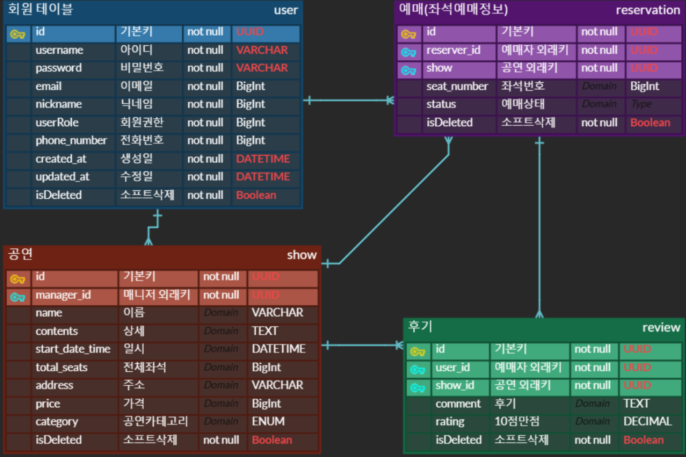
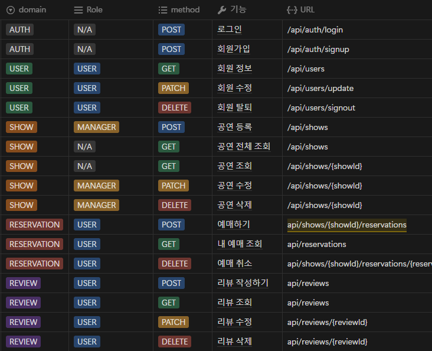
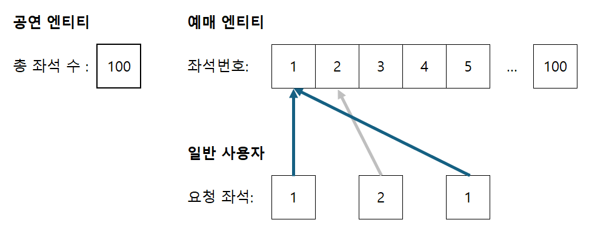

<!-- _class: title -->
# 동시성 제어 기반 <br>티켓팅 서비스 구현
### 12조 **i2**

<br>

김혜진 · 이한식 · 장재혁 · 이지훈


---
# 📁 발표 패키지 구조 >

<div class="grid-container">

<div class="grid-item">

## 🎨 설계 단계

- 🚀 **프로젝트 개요**
- 🎯 **기술적 목표**

</div>

<div class="grid-item">

## 💻 구현 단계

- ⚙️ **핵심 기능 소개**
- 🎥 **영상 시연**
- 🔧 **트러블슈팅 소개**

</div>

</div>

<style scoped>
.grid-container {
  display: grid;
  grid-template-columns: 1fr 1fr;
  gap: 2rem;
  margin-top: 2rem;
}
.grid-item {
  padding: 1rem;
  background: rgba(255,255,255,0.1);
  border-radius: 8px;
}
</style>

---
<!-- _class: title -->
## 🎨 설계 단계

- 🚀 **프로젝트 개요**
- 🎯 **기술적 목표**

---

# <span class="stage">설계/</span> <span class="symbol">✨</span> 프로젝트 개요

## <span class="title">주제 선택</span>

<div class="topic-container">
  <div class="topic-main">
    <h3>동시성 제어</h3>
    <div class="level">
      <span class="badge">난이도: 상</span>
    </div>
  </div>

  <div class="service-info">
    -> <h4 style="display: inline;">🎯 온라인 티켓팅 서비스</h4>
  </div>

  > - **동시다발적 요청**에 에한 동시성 제어 주제에 적합
  > - CRUD 를 단순화하여 **도전 목표**에 집중

</div>

<style scoped>
.title {
  border-bottom: 3px solid #4a90e2;
  padding-bottom: 5px;
}

.topic-container {
  margin: 20px;
  font-size: 1.2em;
}

.topic-main {
  display: flex;
  align-items: center;
  gap: 15px;
  margin-bottom: 20px;
}

.badge {
  background-color: #ff7043;
  color: white;
  padding: 5px 10px;
  border-radius: 15px;
  font-size: 0.8em;
}

.service-info, .goal {
  margin-left: 30px;
  margin-bottom: 15px;
}

.service-name {
  color: #4a90e2;
  font-weight: bold;
  margin-left: 20px;
}

.goal-detail {
  margin-left: 20px;
  color: #666;
}

h3, h4 {
  margin: 0;
  color: #333;
}
</style>

---
# <span class="stage">설계/</span> <span class="symbol">✨</span> 프로젝트 개요

## <span class="title">**인터파크**를 참고한 와이어프레임 작성</span>


<div class="content-wrapper">
  <div class="description">
    <h3>📋 Interparty 핵심 API</h3>
    <ul class="feature-list">
      <li><span class="highlight">일반 사용자</span>
        <ul>
          <li>공연 전체 조회</li>
          <li>공연의 특정 좌석 예매</li>
        </ul>
      </li>
      <li><span class="highlight">공연 담당자</span>
        <ul>
          <li>공연 정보 등록</li>
        </ul>
      </li>
    </ul>
  </div>
</div>

<style scoped>

.description {
  padding: 20px;
  background: rgba(255, 255, 255, 0.9);
  border-radius: 8px;
  box-shadow: 0 2px 4px rgba(0,0,0,0.1);
}

.feature-list {
  list-style-type: none;
  padding-left: 0;
}

.feature-list li {
  margin-bottom: 15px;
}

.feature-list ul {
  list-style-type: circle;
  margin: 8px 0;
  padding-left: 20px;
}

.highlight {
  color: #4a90e2;
  font-weight: bold;
}

h3 {
  color: #333;
  margin-top: 0;
  border-bottom: 2px solid #4a90e2;
  padding-bottom: 8px;
}
</style>

---
# <span class="stage">설계/</span> 🎯 기술적 목표

<div class="goals-container">
  <div class="main-goal">
    <h3>🎯 주요 목표: Redis 응용 기능 둘 다 구현</h3>
    <div class="goal-cards">
      <div class="goal-card">
        <h4>🔒 동시성 제어</h4>
        <p>분산 락을 통한 안전한 티켓팅 구현</p>
      </div>
      <div class="goal-card">
        <h4>💨 캐싱</h4>
        <p>빠른 응답을 위한 데이터 캐싱 구현</p>
      </div>
    </div>
  </div>

  <div class="sub-goals">
    <h3>✨ 부가 목표: 플러스 주차 학습 성과 반영</h3>
    <div class="tech-list">
      <div>
        <span class="tech-icon">🛠</span>
        <strong>Kotlin 100%:</strong>
        프로젝트 생성부터 테스트까지 순수 코틀린으로 구현
      </div>
      <div>
        <span class="tech-icon">🐳</span>
        <strong>Docker:</strong>
        MySQL, Redis 등 컨테이너 기반 개발 환경 구성
      </div>
    </div>
  </div>
</div>

<style scoped>
.goals-container {
  display: flex;
  flex-direction: column;
  gap: 1rem;
  margin-top: 0.5rem;
  font-size: 0.9em;
}

.goal-cards, .tech-stack {
  display: flex;
  gap: 1rem;
  margin-top: 0.5rem;
}

.goal-card, .tech-item {
  background: rgba(49, 130, 206, 0.1);
  padding: 0.8rem;
  border-radius: 8px;
  flex: 1;
}

.goal-card h3 {
  color: #333;
  margin-top: 0;
  border-bottom: 2px solid #4a90e2;
  padding-bottom: 8px;
}
</style>

---
<!-- _class: title -->
## 💻 구현 단계

- ⚙️ **핵심 기능 소개**
- 🎥 **영상 시연**
- 🔧 **트러블슈팅 소개**

---

# <span class="stage">구현/</span> ⚙️ 핵심 기능 소개

## CRUD 기초 구현 (ERD, API)

<div class="erd-container">
  <div class="erd-item">
    
  </div>
  
  <div class="erd-item">
    
  </div>
</div>

<div class="placeholder-image">
  
</div>

<style scoped>
.erd-container {
  display: flex;
  justify-content: center;
  gap: 2rem;
}

.erd-item {
  background: rgba(255, 255, 255, 0.5);
  display: flex;
  align-items: center;
}

.placeholder-image {
  position: fixed;
  bottom: 50px;
  right: 100px;
  z-index: 100;
}

.placeholder-image img {
  width: 300px;
  height: 100px;
  border-radius: 8px;
  box-shadow: 0 2px 4px rgba(0,0,0,0.1);
}
</style>

---

# <span class="stage">구현/</span> ⚙️ 핵심 기능 소개

<div style="display: flex; flex-direction: column; align-items: center;">
  
  <p style="text-align: center;">
    <strong>동시성 문제</strong>가 발생하기 쉬운 <code>예매 API</code> 구현
  </p>
</div>

---

# <span class="stage">구현/</span> ⚙️ 핵심 기능 소개
> 100 개의 자리 * 10 명의 동시성 요청 

- 동시 요청 스레드 수 : 1000
- 예매 실패 횟수 예상 : 900

<div class="code-container">
  <div class="code-block">

  ```java
  필요 :900
  실제 :814
  <클릭하여 차이점 확인>

  예매 실패 횟수: 814 회
  예매된 좌석 번호 목록: [1, 2, 26, 27, 3, 28, 31, 32, 14, 
  4, 18, 16, 17, 20, 22, 23, 43, 24, 25, 5, 13, 44, 42, 
  40, 41, 46, 39, 47, 38, 47, 45, 48, 37, 50, 36, 35, 34, 
  33, 30, 29, 6, 7, 7, 8, 9, 10, 11, 12, 15, 19, 21, 51,
  ```
  </div>
  <div class="code-block">

  ```java
  예매 실패 횟수: 900 회
  예매된 좌석 번호 목록: [1, 17, 2, 3, 48, 47, 18, 19, 39, 
  43, 44, 20, 46, 45, 40, 7, 42, 11, 12, 14, 15, 22, 53, 
  23, 21, 24, 25, 26, 27, 28, 29, 30, 31, 32, 33, 34, 35, 
  36, 37, 38, 52, 51, 49, 50, 4, 5, 6, 8, 10, 9, 13, 16, 
  41, 56, 57, 55, 54, 65, 68, 67, 82, 80, 58, 69, 59, 81, 
  77, 60, 61, 74, 78, 76, 62, 63, 88, 64, 89, 90, 87, 91, 
  92, 86, 83, 93, 85, 70, 71, 79, 72, 66, 73, 75, 84, 94, 
  95, 96, 97, 99, 100, 98]
  ```
  </div>
</div>

<style scoped>
  p {
    font-size: 0.8em;
  }

  pre {
    background: #2d3748;
    color: #e2e8f0;
  }

  .code-container {
    display: flex;
    justify-content: space-between;
    gap: 2rem;
  }

  .code-block {
    flex: 1;
  }

  .code-block pre {
    margin: 0;
    font-size: 0.8em;
  }
</style>

---

# <span class="stage">구현/</span> ⚙️ 핵심 기능 소개


## 캐싱 구현
| 지표 | 조회 v1 | 조회 v2 | 차이 |
|:--|:--:|:--:|--:|
| Total Requests | 620 | 613 | 거의 동일 |
| Avg Resp Time | 315ms | 110ms | 65% 향상 |
| 90th Percentile | 513ms | 57ms | 88.9% 향상 |
| Max Resp Time | 4,425ms | 4,379ms | 거의 동일 |

<style scoped>
table {
  font-size: 0.8em;  /* 기본 폰트 크기의 80%로 축소 */
}
</style>

---

# <span class="stage">구현/</span> ⚙️ 핵심 기능 소개

## 로컬에서의 Docker 활용
```makefile
up:
  wsl docker run -td --name redis_interparty -p 6379:6379 redis:alpine

down:
  wsl docker stop redis_interparty && wsl docker rm redis_interparty

ping:
  wsl redis-cli ping

clear:
  wsl sudo systemctl stop redis && wsl docker container prune -f
```

<style scoped>
pre {
  background: #2d3748;
  color: #e2e8f0;
}
</style>

---
# <span class="stage">구현/</span> 🎥 영상 시연

<div class="video-container">
  <a href="유튜브_링크" target="_blank">
    
    <div class="play-button">▶</div>
  </a>
</div>

<style scoped>
.video-container {
  position: relative;
  text-align: center;
  margin: 2em 0;
}

.play-button {
  position: absolute;
  top: 50%;
  left: 50%;
  transform: translate(-50%, -50%);
  font-size: 4em;
  color: white;
  text-shadow: 0 0 10px rgba(0,0,0,0.5);
  opacity: 0.8;
}

.video-container:hover .play-button {
  opacity: 1;
}
</style>

---
# <span class="stage">구현/</span>🔧 트러블슈팅 소개

> 분산 락과 Transactional 범위 문제

> UUID 중복 생성 문제

> Redis 빌드 테스트로 인한 CI 불가능 문제

---

# <span class="stage">Q&A</span> 💬 질의응답

<div style="display: flex; justify-content: center; align-items: center; height: 70vh;">
  <h1 style="font-size: 4em; color: #3182ce;">Q & A</h1>
</div>

<style scoped>
h1 {
  text-shadow: 2px 2px 4px rgba(0,0,0,0.1);
  background: none;
}
</style>
